# Week 7 — E-commerce Backend with Database Integration

A Spring Boot backend demonstrating Spring Data JPA, complex entity
relationships, transactional order processing, Flyway migrations, and
query optimization on top of PostgreSQL.

## Tech Stack

- Java 17, Spring Boot 3.3
- Spring Data JPA / Hibernate
- PostgreSQL + HikariCP connection pooling
- Flyway for schema migrations
- Spring Security (BCrypt password hashing)
- Spring Cache (product catalog caching)

## Project Structure

```
week7-ecommerce-backend/
├── src/main/java/com/ecommerce/
│   ├── EcommerceApplication.java      # entry point (@EnableJpaAuditing, @EnableCaching)
│   ├── controller/                    # REST endpoints
│   ├── service/                       # business logic + @Transactional boundaries
│   ├── repository/                    # Spring Data JPA repositories
│   ├── model/entity/                  # JPA entities (User, Product, Category, Order, OrderItem, Payment)
│   ├── model/dto/                     # API request/response objects
│   ├── model/enums/                   # OrderStatus, PaymentStatus, Role
│   ├── config/                        # DatabaseConfig, SecurityConfig, CacheConfig
│   └── exception/                     # custom exceptions + global handler
├── src/main/resources/
│   ├── db/migration/                  # V1 schema, V2 seed data, V3 indexes
│   └── application.yml
├── src/test/                          # integration tests (H2 in-memory)
├── docker-compose.yml                 # local PostgreSQL
└── pom.xml
```

## Entity Relationships

- **User** 1 —— * **Order** (Many-to-One from Order)
- **Order** 1 —— * **OrderItem** (One-to-Many, cascade ALL + orphanRemoval)
- **OrderItem** * —— 1 **Product** (Many-to-One)
- **Order** 1 —— 1 **Payment** (One-to-One, Payment owns the FK)
- **Product** * —— 1 **Category** (Many-to-One, lazy)
- **Category** 1 —— * **Category** (self-referencing parent/children, hierarchical)

## Running Locally

Prerequisites: Java 17, Maven (or use the included `./mvnw` wrapper), and
Docker (for PostgreSQL) — no other setup required.

```bash
# 1. Clone the repo and cd into it
git clone <your-repo-url>
cd week7-ecommerce-backend

# 2. Start PostgreSQL (creates the ecommerce_db database automatically)
docker compose up -d

# 3. Run the app — Flyway migrates the schema and loads seed data automatically
./mvnw spring-boot:run
```

The app starts on `http://localhost:8081`. On first boot, Flyway applies, in order:
- `V1__initial_schema.sql` — creates all tables
- `V2__seed_data.sql` — loads categories, demo users, and ~20 sample products
- `V3__add_indexes.sql` — adds performance indexes

No manual database setup is needed — `docker compose up -d` creates the
Postgres container with the right database name/credentials already baked
in (matching the defaults in `application.yml`), and Flyway builds the
schema and data for you on startup.

Demo login (seeded in V2): username `jdoe` / password `password123` (same
password for `admin`, `asmith`, `mgarcia`).

## ⚠️ Authentication status (read this first)

**Every endpoint is currently open — no login/token is required to call
any of them.** This is intentional for this stage of the assignment, so
the API can be tested immediately via curl/Postman without a JWT flow.

Password hashing (BCrypt) and login/register are already implemented in
`AuthController` — what's missing is a filter that turns a valid login
into an enforced, per-request identity. See the comment block at the top
of `SecurityConfig.java` for exactly what to add (a `JwtAuthenticationFilter`)
when you're ready to lock endpoints down.

## Testing the API

With the app running on `http://localhost:8081`, here's a full pass
through every endpoint. No `Authorization` header is needed for any of
these right now.

### Health check

curl http://localhost:8081/api/products
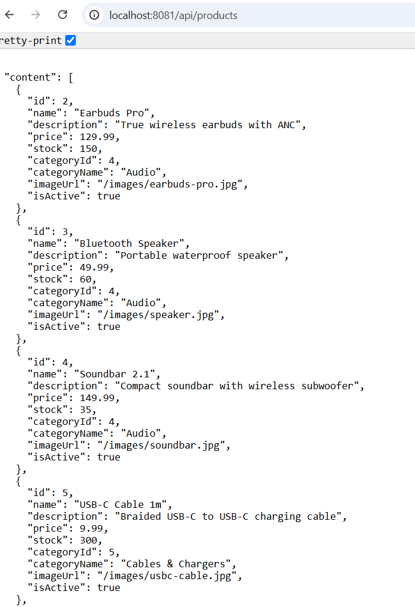

If this returns a JSON page of products, the app, database, and migrations
all worked.

### Auth
```bash
# Register a new user
curl -X POST http://localhost:8081/api/auth/register -H "Content-Type: application/json" -d "{\"username\":\"testuser\",\"email\":\"test@example.com\",\"password\":\"password123\",\"firstName\":\"Test\",\"lastName\":\"User\"}"
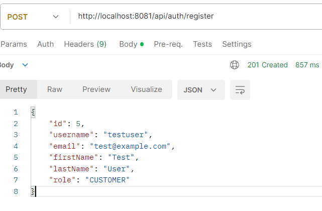

# Log in with a seeded user
curl -X POST http://localhost:8081/api/auth/login -H "Content-Type: application/json" -d "{\"username\":\"testuser\",\"password\":\"password123\"}"
```
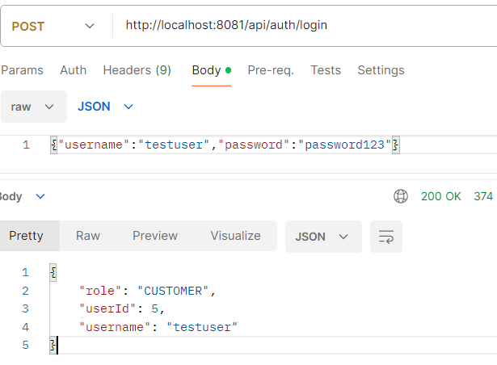

### Products
```bash
# List products (paginated)
curl "http://localhost:8081/api/products?page=0&size=10"
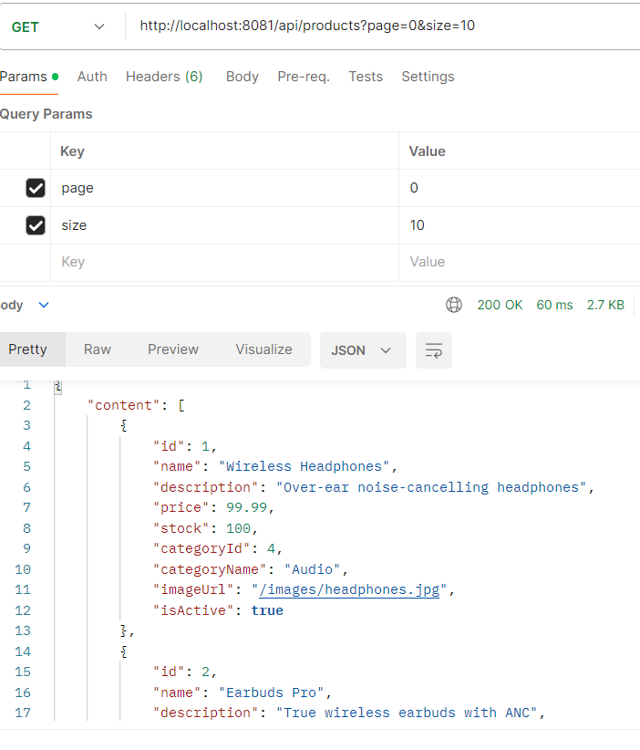

# Filter by category and price range
curl "http://localhost:8081/api/products?categoryId=1&minPrice=10&maxPrice=100&sort=price,asc"
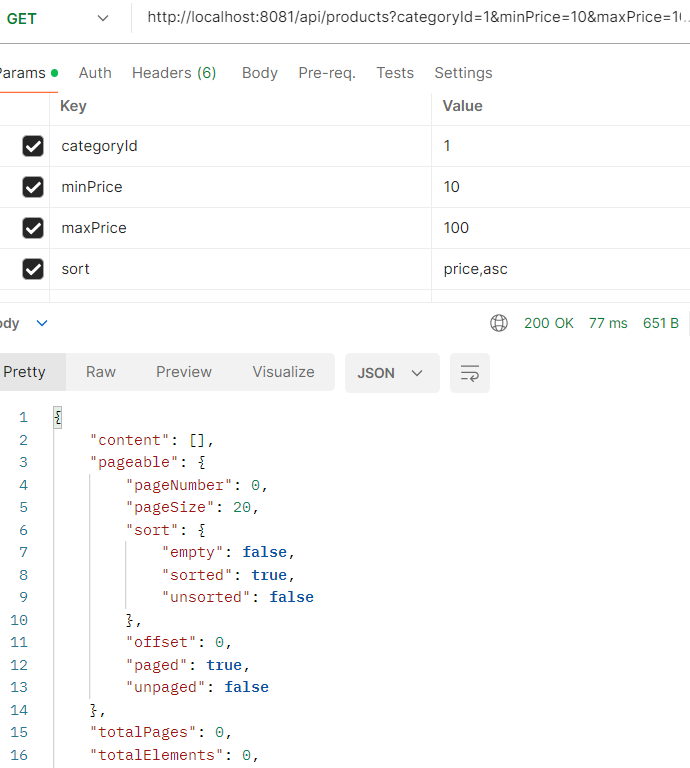

# Get a single product
curl http://localhost:8081/api/products/1
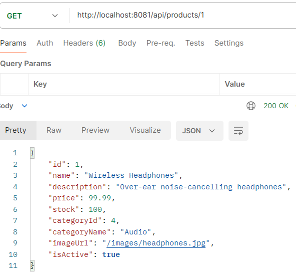

# Create a product
curl -X POST http://localhost:8081/api/products -H "Content-Type: application/json" -d "{\"name\":\"Test Product\",\"description\":\"A test\",\"price\":19.99,\"stock\":50,\"categoryId\":1}"
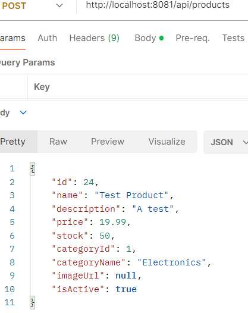

# Update / delete
curl -X PUT http://localhost:8081/api/products/1 -H "Content-Type: application/json" -d "{\"name\":\"Updated Name\",\"price\":24.99,\"stock\":40,\"categoryId\":1}"
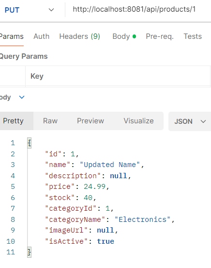

curl -X DELETE http://localhost:8081/api/products/1
```

### Orders
```bash
# Create an order (see full JSON example further below)
curl -X POST http://localhost:8081/api/orders -H "Content-Type: application/json" -d "{\"userId\":2,\"items\":[{\"productId\":1,\"quantity\":2}],\"shippingAddress\":\"123 Main St\"}"
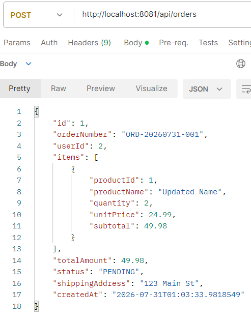

# Get a user's order history
curl "http://localhost:8081/api/orders?userId=2&page=0&size=10"
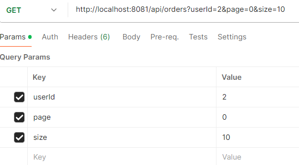

# Get by order number
curl http://localhost:8081/api/orders/ORD-000001

# Cancel an order
curl -X PUT http://localhost:8081/api/orders/1/cancel
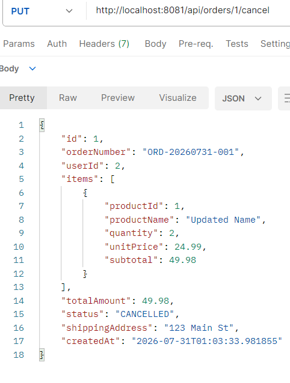

# Daily sales report
curl "http://localhost:8081/api/orders/report/daily?since=2024-01-01T00:00:00"
```

### Payments
```bash
curl -X POST "http://localhost:8081/api/payments/1?method=CREDIT_CARD"
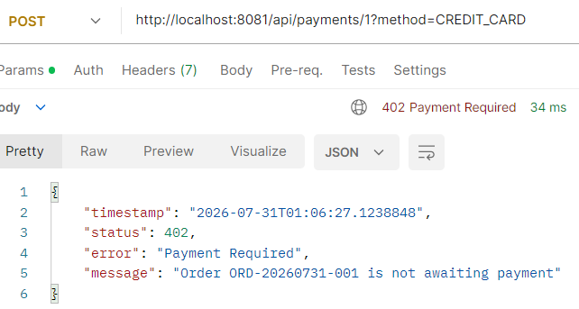

curl http://localhost:8081/api/payments/order/1
```

### Users
```bash
curl http://localhost:8081/api/users/2/profile
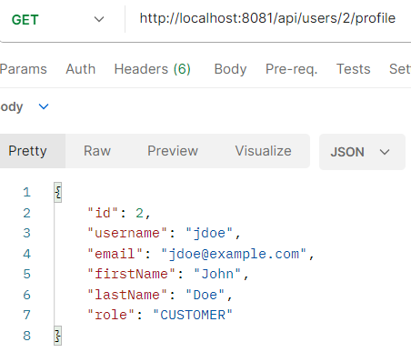

curl -X PUT http://localhost:8081/api/users/2/profile -H "Content-Type: application/json" -d "{\"username\":\"jdoe\",\"email\":\"jdoe@example.com\",\"firstName\":\"Jonathan\",\"lastName\":\"Doe\"}"
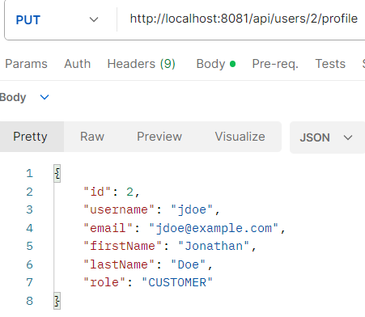
```

Easier alternative to curl on Windows: import these into **Postman** or
use the **Thunder Client** VS Code extension — same requests.

## Running Tests

```bash
./mvnw test
```

Tests run against an in-memory H2 database (`application-test.yml`), so no
PostgreSQL instance is required. `OrderServiceIntegrationTest` specifically
verifies the transactional rollback behavior: if any item in a multi-item
order has insufficient stock, the *entire* order — including stock already
decremented for earlier items in the same request — rolls back.


## Sample API Usage

### Create an order
```
POST /api/orders
Content-Type: application/json

{
  "userId": 1,
  "items": [
    { "productId": 1, "quantity": 2 },
    { "productId": 2, "quantity": 1 }
  ],
  "shippingAddress": "123 Main St, City, Country"
}
```

### Filter products
```
GET /api/products?categoryId=2&minPrice=10&maxPrice=100&page=0&size=20&sort=price,asc
```

### Daily sales report (native query)
```
GET /api/orders/report/daily?since=2024-01-01T00:00:00
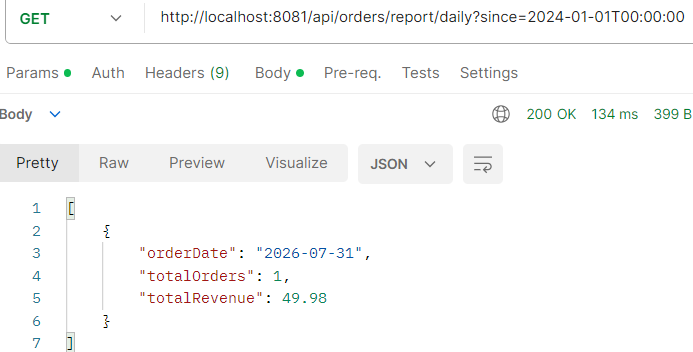
```

## Query Optimization Notes

- Indexes added in `V3__add_indexes.sql` cover the columns most frequently
  used in `WHERE`/`JOIN` clauses: `products(name)`, `products(category_id)`,
  `orders(user_id)`, `orders(status)`, `order_items(order_id)`,
  `order_items(product_id)`.
- `spring.jpa.properties.hibernate.default_batch_fetch_size` batches lazy
  collection loads instead of issuing one query per parent row.
- `spring.jpa.open-in-view: false` forces lazy-loading decisions to be made
  explicitly in the service layer, rather than accidentally in the view/
  serialization layer where N+1 problems typically go unnoticed.

## Environment Variables

| Variable       | Default        | Purpose                     |
|----------------|----------------|------------------------------|
| `DB_HOST`      | `localhost`    | PostgreSQL host              |
| `DB_PORT`      | `5432`         | PostgreSQL port               |
| `DB_NAME`      | `ecommerce_db` | Database name                 |
| `DB_USER`      | `postgres`     | Database user                  |
| `DB_PASSWORD`  | `postgres`     | Database password               |
| `JWT_SECRET`   | (dev default)  | Secret for future JWT auth       |
